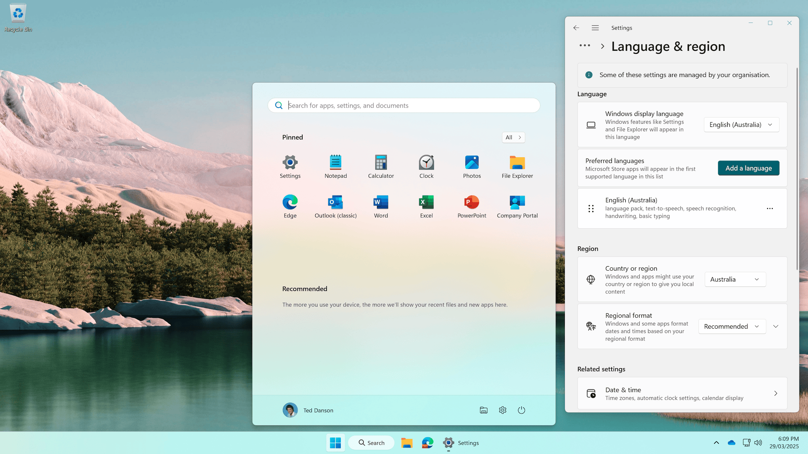

Windows Enterprise Defaults is designed to customize Windows images, replacing Microsoft defaults to make them enterprise-ready. While Microsoft's defaults cater to a broad range of users—from individuals to enterprises—an optimized enterprise desktop requires tailored adjustments.

This solution streamlines modifications to Windows by updating the default profile, Start menu, taskbar, user environment, and Explorer settings. It also manages Windows capabilities, features, and removes certain in-box application packages.

Windows Enterprise Defaults is not a "de-bloater", instead it focuses on making thoughtful changes without compromising the end-user experience. Though it removes some in-box applications and features, it ensures usability remains intact.

Supporting Windows 10, Windows 11, and Windows Server 2016–2025, this tool works for both physical PCs and virtual machines (e.g., Azure Virtual Desktop, Windows 365). While primarily aimed at provisioning gold images for PCs or virtual desktops, it can also be applied to Windows Server infrastructure roles.

## Usage

The solution is intended for operating system deployment via various methods, including:

* Imported into the Microsoft Deployment Toolkit as an application for use during Lite Touch deployments - [Create a New Application in the Deployment Workbench](https://docs.microsoft.com/en-us/mem/configmgr/mdt/use-the-mdt#CreateaNewApplicationintheDeploymentWorkbench)
* Imported into Configuration Manager for use during Zero Touch deployments: - [Create applications in Configuration Manager](https://docs.microsoft.com/en-us/mem/configmgr/apps/deploy-use/create-applications)
* Packaged as a Win32 application and delivered via Microsoft Intune during Windows Autopilot - [Win32 app management in Microsoft Intune](https://docs.microsoft.com/en-us/mem/intune/apps/apps-win32-app-management)
* Executed in a virtual machine image pipeline using [Azure Image Builder](https://docs.microsoft.com/en-us/azure/virtual-machines/image-builder-overview) or [Packer](https://www.packer.io/) when building a gold image
* Or even run manually on a Windows PC or virtual machine gold image if you're not using automation at all

## Results

This package will configure the Windows image ready for the enterprise and the end-user. Here's the default Windows 11 desktop:

And here's a Windows 11 desktop after customisation - note that regional settings are configured, there's default Start menu, the search box in the taskbar has been reduced in size, many of the in-box applications have been uninstalled, and the default wallpaper has been set back to the Windows 11 bloom wallpaper (instead of Windows spotlight).

When used in provisioning devices with Windows Autopilot, other deployment tools, or with a VDI solution or Windows 365, and combined with Intune policies or Group Policy settings, the default user desktop should then be similar to the following screenshot:

## Supported Platforms

Windows Enterprise Defaults has been tested on Windows 10 (1809 and above), Windows 11, Windows Server 2016-2025. All scripts should work on any future versions of Windows; however, you should test thoroughly before deployment in production.

!!! note ""

    Windows PowerShell only is supported - typically during operating system deployments, there should be no strict requirement for PowerShell 6 or above. While the solution should work OK on PowerShell 6+, no testing is done on those versions.

---
[Laptop Settings](https://icons8.com/icon/iSNxtIhB8C9B/laptop-settings) by [Icons8](https://icons8.com).
